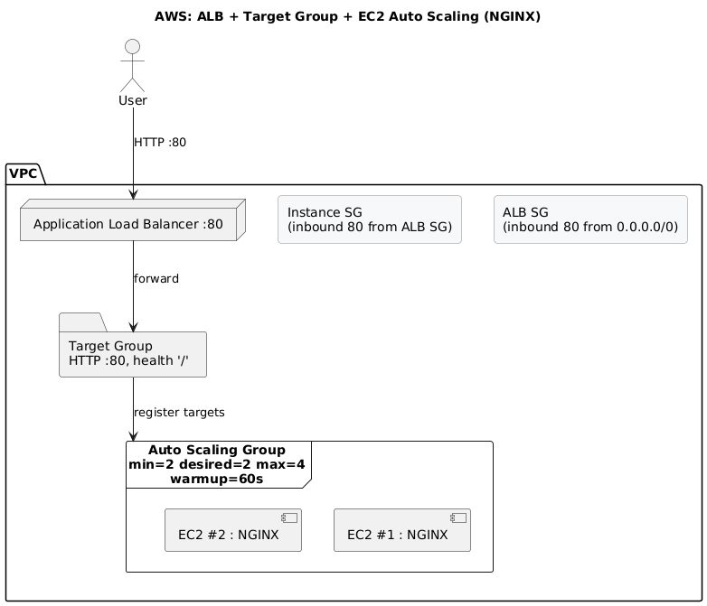

## How to Run (Console walkthrough)

> Goal: Deploy an **ALB → Target Group → Auto Scaling Group** that serves **Nginx** instances across **2 AZs** and automatically scales based on **ALB RequestCountPerTarget**.

### Prerequisites
- AWS account (N. Virginia `us-east-1` used in this guide)
- IAM permissions to create EC2/ALB/ASG resources
- (Optional) EC2 key pair if you want to SSH



## Launch template user data (Nginx)
Launch Template user data: [`scripts/user-data.sh`](scripts/user-data.sh)

#!/bin/bash
set -euxo pipefail
dnf -y update
dnf -y install nginx

TOKEN="$(curl -sS -X PUT 'http://169.254.169.254/latest/api/token' \
  -H 'X-aws-ec2-metadata-token-ttl-seconds: 21600' || true)"

md() {
  local path="$1"
  if [ -n "$TOKEN" ]; then
    curl -sS -H "X-aws-ec2-metadata-token: $TOKEN" "http://169.254.169.254${path}"
  else
    curl -sS "http://169.254.169.254${path}"
  fi
}

INSTANCE_ID="$(md /latest/meta-data/instance-id)"
AZ="$(md /latest/meta-data/placement/availability-zone)"
HOSTNAME_FQDN="$(hostname -f || hostname)"

cat > /usr/share/nginx/html/index.html <<EOF
<!doctype html>
<html>
<head><meta charset="utf-8"><title>ASG Demo</title></head>
<body style="font-family:system-ui;max-width:720px;margin:40px auto;">
<h1>Hello from $INSTANCE_ID</h1>
<p>Hostname: $HOSTNAME_FQDN<br>AZ: $AZ</p>
</body>
</html>
EOF

systemctl enable --now nginx

### 1) Create Security Groups

**a) ALB security group – `alb-web`**
- Inbound: `HTTP (80)` from `0.0.0.0/0`
- Outbound: allow all (default)

**b) Instance security group – `web-instances`**
- Inbound: `HTTP (80)` **from security group** `alb-web` (select SG as the source, *not* a CIDR)
- Outbound: allow all (default)

---

### 2) Create Target Group
- **Type:** *Instances*
- **Protocol/Port:** HTTP : `80`
- **VPC:** your default VPC (same as ALB/ASG)
- **Health checks:** HTTP → Path `/`
- Create now (don’t register targets yet)

---

### 3) Create an Application Load Balancer (ALB)
- **Scheme:** Internet-facing  
- **Type:** Application
- **Network mapping:** pick **two public subnets** (two different AZs)
- **Security group:** `alb-web`
- **Listeners:** HTTP : `80` → **Forward to** the target group you created in step 2

> After it provisions, note the ALB **DNS name** (e.g., `alb-xxxx.us-east-1.elb.amazonaws.com`).

---

### 4) Create a Launch Template
- **AMI:** Amazon Linux 2023
- **Instance type:** `t2.micro`
- **Security group:** `web-instances`
- **User data:** use this repo’s script: [`scripts/user-data.sh`](scripts/user-data.sh)  
  (copies an Nginx index with hostname & AZ)

> Leave subnet and key pair unset in the template (ASG will choose subnets).

---

### 5) Create an Auto Scaling Group (ASG)
- **Launch template:** select the one you created above
- **VPC / Subnets:** pick **two subnets** across different AZs
- **Group size:** `Desired=2`, `Min=2`, `Max=4`
- **Attach to existing target group:** choose the TG from step 2
- **Health checks:** enable **ELB** health checks
- **Instance warmup:** `60s`

**Dynamic scaling policy (Target tracking)**
- **Policy type:** Target tracking
- **Metric:** *Application Load Balancer request count per target*
- **Target value:** `60`
- **Warmup:** `60s`

Create the ASG. After a few minutes you should have **2 healthy instances** behind the ALB.

---

### 6) Generate load (optional)
On macOS:
```bash
brew install hey
export URL="http://<your-alb-dns-name>"
hey -z 3m -q 12 "$URL/"     # ~3 minutes of traffic

